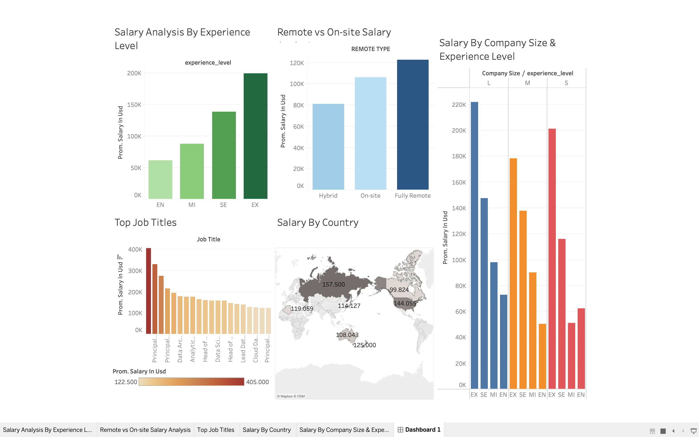

# 💼 Salary Analytics Dashboard with SQL & Tableau

This project analyzes **Data Science salaries globally**, aiming to uncover trends by **experience level, job title, company size, remote work, and country**.  

It covers the **full data analysis workflow**: data cleaning, exploration, aggregation with SQL, and visualization through **Tableau**.

---

## 🧠 Analysis Objectives

- Analyze the average salary by **experience level**  
- Identify **highest-paying job titles**  
- Explore how **company size** impacts salaries  
- Compare **remote vs on-site roles**  
- Examine **salary differences across countries**  
- Build an **interactive dashboard** to visualize insights  

---

## 🛠️ Technologies Used

- **SQL / PostgreSQL** – Data extraction, aggregation, advanced queries (CTEs, window functions)  
- **Tableau** – Interactive dashboard visualization  
- **CSV Dataset** – Real-world Data Science salaries  
- **GitHub** – Version control and portfolio showcase  

---

## 📂 Project Structure

| Folder        | Description                                         |
|---------------|-----------------------------------------------------|
| `sql/`        | SQL queries used for analysis                        |
| `tableau/`    | Tableau workbook (`SALARIES.twb`)                    |
| `dashboard/`  | Dashboard screenshots                                |
| `data/`       | Dataset CSV (`ds_salaries.csv`)                      |
| `README.md`   | Project documentation                                |

---

## 📊 Dashboard Overview

The Tableau dashboard allows interactive exploration of:

- **Salary by Experience Level**  
- **Top Job Titles by Salary**  
- **Salary by Company Size**  
- **Remote vs On-site Salary Comparison**  
- **Salary by Country**  
- **Top Earners Ranking by Experience Level**  

---

## 🔍 Key Insights

- Senior-level roles consistently earn higher salaries, but specialized roles like **ML Engineer** also rank top at mid-levels  
- **Remote roles** often pay more than on-site positions  
- Some countries dominate in average salary, highlighting geographic disparities  
- Smaller companies sometimes offer competitive salaries to attract talent  
- Using **CTEs and window functions** in SQL allows ranking and percentile analysis for richer dashboard insights  

---

